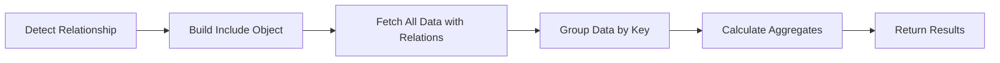

# 🛠 @dwcahyo/nestjs-prisma-pipes

**NestJS + Prisma query pipes**  
Parse query strings (`where`, `orderBy`, `select`, `include`, `aggregate`) directly into **Prisma-ready objects**.  
No more manual parsing — just pass query params, and you're good to go 🚀

---

## 📜 Changelog

### [2.4.6] - 2025 🔥 NEW

#### 🚀 Added - Manual Aggregation for Nested Relationships

##### The Problem
Prisma's `groupBy` doesn't support relationship fields directly:
```typescript
// ❌ This doesn't work with Prisma
groupBy: {
  by: ['marketingMasterCategory.category'] // Error: Can't group by relation
}
```

##### The Solution
**Manual In-Memory Aggregation** - When `AggregatePipe` detects relationship fields (containing `.`), it automatically switches to manual aggregation mode!

```typescript
// ✅ This now works!
?aggregate=qty: sum(), groupBy: (marketingMasterCategory.category)
```

##### Features
- **🔍 Auto-Detection**: Automatically detects relationship fields (fields with `.`)
- **🔄 Seamless Fallback**: Uses standard Prisma for simple fields, manual aggregation for relationships
- **🔗 Auto-Include**: Automatically includes relationships using Prisma's `include`
- **📊 Chart Compatible**: Works with all chart types and time series
- **🎯 Type Safe**: Full TypeScript support with proper types
- **✨ Simple**: No raw SQL, no complex queries - just fetch and process

##### How It Works

**1. Simple Fields (Standard Prisma)**
```url
?aggregate=qty: sum(), groupBy: (category)
```
→ Uses Prisma `groupBy` (faster, native)

**2. Relationship Fields (Manual Aggregation)**
```url
?aggregate=qty: sum(), groupBy: (marketingMasterCategory.category)
```
→ Fetches data with `include`, groups and aggregates in-memory

**3. Mixed Fields (Manual Aggregation)**
```url
?aggregate=qty: sum(), groupBy: (marketingMasterCategory.category, warehouse.region)
```
→ Handles multiple relationships automatically

##### Processing Flow

When relationship fields are detected:



**Step 1: Fetch with Relationships**
```typescript
// Auto-generated include
{
  include: {
    marketingMasterCategory: true,
    warehouse: true
  }
}
```

**Step 2: Group In-Memory**
```typescript
// Groups by composite key
"Electronics|||Warehouse A" -> [item1, item2, ...]
"Clothing|||Warehouse B" -> [item3, item4, ...]
```

**Step 3: Calculate Aggregates**
```typescript
// For each group, calculate sum, avg, min, max, count
{ 
  marketingMasterCategory: { category: "Electronics" },
  _sum: { qty: 1500 },
  _avg: { qty: 150 }
}
```

##### Service Layer Implementation

**Option 1: Using Static Execute Method (Recommended)**

```typescript
import { Injectable, BadRequestException } from '@nestjs/common';
import { PrismaService } from './prisma.service';
import { Pipes, AggregatePipe } from '@dwcahyo/nestjs-prisma-pipes';

@Injectable()
export class ProductService {
  constructor(private readonly prisma: PrismaService) {}

  async stat(
    filter?: Pipes.Where,
    aggregate?: Pipes.Aggregate,
  ): Promise<Pipes.ChartSeries> {
    if (!aggregate) {
      throw new BadRequestException('Aggregate query is required');
    }

    try {
      // AggregatePipe.execute handles everything:
      // - Detects if manual aggregation is needed
      // - Fetches data with relationships
      // - Performs grouping and calculations
      // - Returns Prisma-compatible format
      const data = await AggregatePipe.execute(
        this.prisma.product,
        aggregate,
        filter
      );

      // Transform to chart format
      return AggregatePipe.toChartSeries(data, aggregate);
    } catch (error) {
      console.error('Aggregate error:', error);
      throw new BadRequestException(
        `Failed to execute aggregate query: ${error.message}`
      );
    }
  }
}
```

**Option 2: Generic Base Service**

```typescript
import { Injectable, BadRequestException } from '@nestjs/common';
import { PrismaService } from './prisma.service';
import { Pipes, AggregatePipe } from '@dwcahyo/nestjs-prisma-pipes';

@Injectable()
export class BaseService<T> {
  constructor(
    protected readonly prisma: PrismaService,
    protected readonly modelName: string,
  ) {}

  async stat(
    filter?: Pipes.Where,
    aggregate?: Pipes.Aggregate,
  ): Promise<Pipes.ChartSeries> {
    if (!aggregate) {
      throw new BadRequestException('Aggregate query is required');
    }

    try {
      const model = this.prisma[this.modelName];
      
      // Single method handles all cases
      const data = await AggregatePipe.execute(
        model,
        aggregate,
        filter
      );

      return AggregatePipe.toChartSeries(data, aggregate);
    } catch (error) {
      console.error('Aggregate error:', error);
      throw new BadRequestException(
        `Failed to execute aggregate query: ${error.message}`
      );
    }
  }
}

// Usage in specific services
@Injectable()
export class ProductService extends BaseService<Product> {
  constructor(prisma: PrismaService) {
    super(prisma, 'product');
  }
}

@Injectable()
export class OrderService extends BaseService<Order> {
  constructor(prisma: PrismaService) {
    super(prisma, 'order');
  }
}
```

**Controller Usage:**

```typescript
import { Controller, Get, Query } from '@nestjs/common';
import { ProductService } from './product.service';
import { Pipes, WherePipe, AggregatePipe } from '@dwcahyo/nestjs-prisma-pipes';

@Controller('products')
export class ProductController {
  constructor(private readonly productService: ProductService) {}

  @Get('stats')
  async getStats(
    @Query('where', WherePipe) where?: Pipes.Where,
    @Query('aggregate', AggregatePipe) aggregate?: Pipes.Aggregate
  ): Promise<Pipes.ChartSeries> {
    return this.productService.stat(where, aggregate);
  }
}
```

##### Real-World Examples

**Example 1: Sales by Category (Relationship)**
```bash
GET /products/stats?aggregate=qty: sum(), recQty: sum(), groupBy: (marketingMasterCategory.category), chart: bar(marketingMasterCategory.category, horizontal)
```

**What happens:**
1. Pipe detects `.` in `marketingMasterCategory.category`
2. Sets `useManualAggregation: true`
3. Builds include: `{ marketingMasterCategory: true }`
4. Fetches all products with category data
5. Groups by category in-memory
6. Calculates sum(qty) and sum(recQty) for each group

**Result:**
```json
{
  "categories": ["Electronics", "Clothing", "Food"],
  "series": [
    {
      "name": "sum(qty)",
      "data": [1500, 800, 1200]
    },
    {
      "name": "sum(recQty)",
      "data": [150, 80, 120]
    }
  ],
  "chartType": "bar",
  "horizontal": true
}
```

**Example 2: Regional Performance**
```bash
GET /products/stats?aggregate=qty: sum(), groupBy: (warehouse.region, marketingMasterCategory.category), chart: bar(warehouse.region, stacked)
```

**Manual aggregation:**
- Fetches with `{ warehouse: true, marketingMasterCategory: true }`
- Groups by composite key: `region|||category`
- Stacks series by category per region

**Example 3: Time Series with Relationships**
```bash
GET /orders/stats?aggregate=revenue: sum(), groupBy: (customer.segment, orderDate), chart: line(orderDate, month)
```

**Processing:**
- Includes `customer` relation
- Groups by segment + month
- Creates separate line series per segment

##### Configuration Required

**Update your Prisma schema:**
```prisma
// prisma/schema.prisma
model Product {
  id                          Int                      @id @default(autoincrement())
  qty                         Int
  recQty                      Int
  marketingMasterCategoryId   Int
  warehouseId                 Int
  
  // Define relations
  marketingMasterCategory     MarketingMasterCategory  @relation(fields: [marketingMasterCategoryId], references: [id])
  warehouse                   Warehouse                @relation(fields: [warehouseId], references: [id])
}

model MarketingMasterCategory {
  id        Int       @id @default(autoincrement())
  category  String
  products  Product[]
}

model Warehouse {
  id        Int       @id @default(autoincrement())
  region    String
  products  Product[]
}
```

**No special configuration needed** - the pipe automatically:
- Detects relationships
- Builds include objects
- Handles nested structures
- Performs calculations

##### TypeScript Types

```typescript
export namespace Pipes {
  export interface Aggregate {
    prismaQuery: {
      by?: string[];
      _sum?: Record<string, true>;
      _avg?: Record<string, true>;
      _min?: Record<string, true>;
      _max?: Record<string, true>;
      _count?: true | Record<string, true>;
    } | null; // null when useManualAggregation is true
    aggregates: AggregateSpec[];
    groupBy: string[];
    isGrouped: boolean;
    chartConfig?: ChartConfig;
    
    // NEW in v2.4.6
    useManualAggregation: boolean;
  }
}
```

##### Migration Guide

**Before (v2.4.2 and earlier):**
```typescript
// This would fail with relationship fields
async stat(filter?: Pipes.Where, aggregate?: Pipes.Aggregate) {
  const data = await this.prisma.product.groupBy({
    where: filter,
    ...aggregate.prismaQuery, // Error if groupBy has relationship
  });
  
  return AggregatePipe.toChartSeries(data, aggregate);
}
```

**After (v2.4.6):**
```typescript
// Now handles both simple and relationship fields automatically
async stat(filter?: Pipes.Where, aggregate?: Pipes.Aggregate) {
  // Single method handles everything
  const data = await AggregatePipe.execute(
    this.prisma.product,
    aggregate,
    filter
  );
  
  return AggregatePipe.toChartSeries(data, aggregate);
}
```

##### Performance Considerations

**Prisma groupBy vs Manual Aggregation:**

| Aspect | Prisma groupBy | Manual Aggregation |
|--------|---------------|-------------------|
| **Speed** | ⚡ Faster (database-level) | 🔸 Slower (in-memory) |
| **Memory** | ✅ Minimal | ⚠️ Loads all data |
| **Relationships** | ❌ Not supported | ✅ Fully supported |
| **Flexibility** | 🔸 Limited | ✅ Full control |
| **When to use** | Simple fields | Nested relationships |

**Best Practices:**

1. **Use simple fields when possible** - Prisma groupBy is faster
   ```url
   ✅ ?aggregate=qty: sum(), groupBy: (category)
   ```

2. **Optimize WHERE filters** - Reduce data fetched for manual aggregation
   ```url
   ✅ ?where=createdAt: gte(2025-01-01)&aggregate=qty: sum(), groupBy: (marketingMasterCategory.category)
   ```

3. **Add database indexes** - Helps with data retrieval
   ```prisma
   @@index([marketingMasterCategoryId])
   @@index([warehouseId])
   ```

4. **Consider pagination** - For very large datasets
   ```typescript
   // Add pagination support to reduce memory usage
   const data = await this.prisma.product.findMany({
     where: filter,
     include: buildIncludeForRelationships(aggregate.groupBy),
     take: 10000, // Limit records
   });
   ```

5. **Cache results** - For frequently accessed aggregations
   ```typescript
   @Cacheable({ ttl: 3600 }) // Cache for 1 hour
   async stat(filter?: Pipes.Where, aggregate?: Pipes.Aggregate) {
     return AggregatePipe.execute(this.prisma.product, aggregate, filter)
       .then(data => AggregatePipe.toChartSeries(data, aggregate));
   }
   ```

##### Advantages of Manual Aggregation

**✅ Simplicity**
- No raw SQL to write or maintain
- No complex query builders
- Just fetch and process

**✅ Flexibility**
- Works with any Prisma model
- Supports complex nested relationships
- Easy to extend with custom logic

**✅ Type Safety**
- Full TypeScript support
- Prisma's type inference works
- No type casting needed

**✅ Maintainability**
- Uses standard Prisma APIs
- Easy to understand and debug
- No database-specific code

##### Limitations & Notes

1. **Memory Usage**: Loads all filtered records into memory before grouping
   - ⚠️ Be cautious with large datasets (>100K records)
   - ✅ Use WHERE filters to reduce data volume
   - ✅ Consider pagination for very large results

2. **Performance**: Slower than database-level groupBy
   - 🔸 Acceptable for most use cases (<10K records)
   - ⚠️ May be slow for millions of records
   - ✅ Use caching for frequently accessed data

3. **Nested Relations**: Currently supports one level deep
   - ✅ `category.name` works
   - ✅ `warehouse.region` works
   - ⚠️ `order.customer.company.name` may need extension

4. **Aggregate Functions**: All standard functions supported
   - ✅ sum, avg, min, max, count
   - ✅ Works with numeric and date fields
   - ✅ Handles null values properly

##### Troubleshooting

**Issue 1: Out of Memory Error**
```typescript
// Problem: Too many records loaded
// Solution: Add pagination or stricter filters
?where=createdAt: gte(2025-01-01)&aggregate=qty: sum(), groupBy: (category)
```

**Issue 2: Slow Performance**
```typescript
// Problem: Large dataset with manual aggregation
// Solution: Use Prisma groupBy for simple fields
// Instead of: groupBy: (marketingMasterCategory.category)
// Use: Add category field directly to Product model
?aggregate=qty: sum(), groupBy: (category) // Much faster
```

**Issue 3: Relationship Not Found**
```typescript
// Problem: Relation not defined in Prisma schema
// Solution: Ensure relationship exists in schema
model Product {
  marketingMasterCategory MarketingMasterCategory @relation(...)
  //                      ^^^^^^^^^^^^^^^^^^^^^^^ Must match field name
}
```

**Issue 4: Incorrect Results**
```typescript
// Problem: Null values causing issues
// Solution: Manual aggregation handles nulls properly
// Filter in WHERE clause if needed
?where=marketingMasterCategoryId: not(null)&aggregate=...
```

##### When to Use Manual Aggregation vs Prisma groupBy

**Use Prisma groupBy (Standard) when:**
- ✅ Grouping by direct model fields
- ✅ Working with large datasets (>100K records)
- ✅ Performance is critical
- ✅ No relationships needed

**Use Manual Aggregation when:**
- ✅ Grouping by relationship fields
- ✅ Dataset is manageable (<100K records)
- ✅ Flexibility is more important than speed
- ✅ Complex nested relationships needed

**Example Decision Tree:**
```
Need to group by relationship field?
├─ Yes → Use Manual Aggregation
│         Dataset size?
│         ├─ < 10K records → ✅ Perfect use case
│         ├─ 10K-100K records → ✅ Good, add caching
│         └─ > 100K records → ⚠️ Consider denormalization
│
└─ No → Use Prisma groupBy (Standard)
         └─ ✅ Fastest option
```

---

### [2.4.2] - 2025

#### 🚀 Enhanced - Grouped Time Series Support

Added support for combining time series with categorical grouping, enabling multi-series time-based charts.

**Features:**
- Group time series data by additional categorical fields
- Automatic series generation for each group
- Stacked time series charts
- Compatible